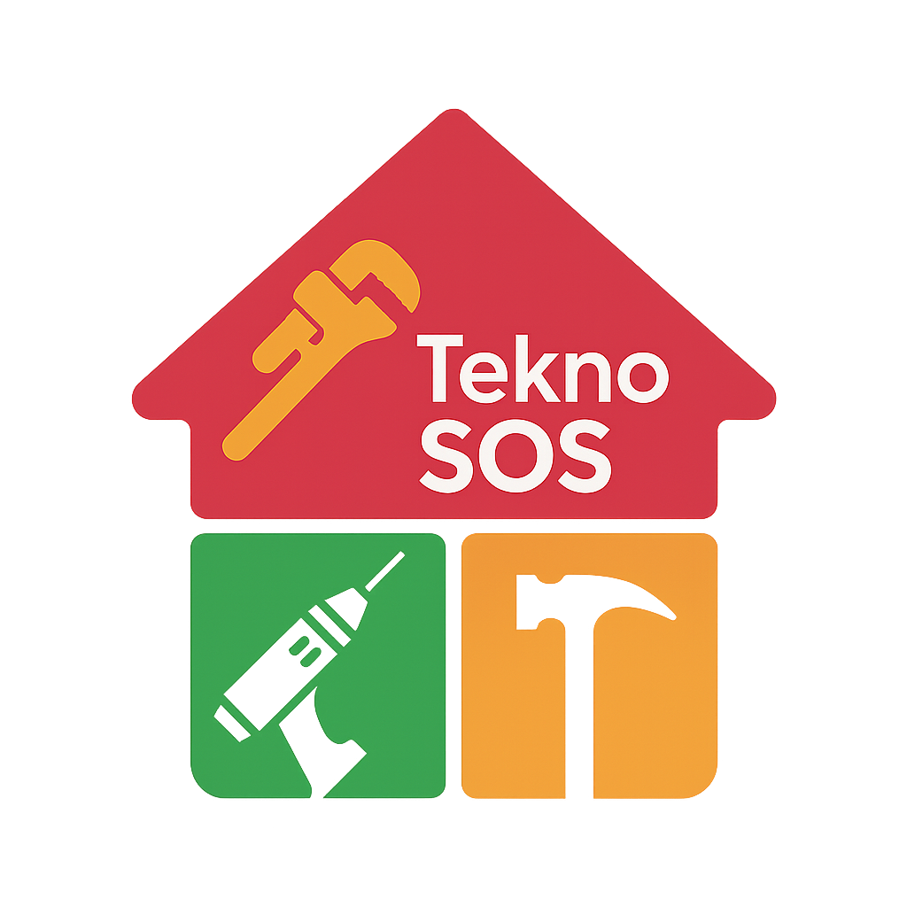

# TeknoSOS — Platforma e Menaxhimit të Shërbimeve Teknike

<div align="center">



**Platformë full-stack që lidh qytetarët me teknikë të certifikuar për shërbime mirëmbajtjeje.**

[](https://dotnet.microsoft.com/)
[](https://www.microsoft.com/sql-server)
[](https://getbootstrap.com/)
[](https://docs.microsoft.com/aspnet/signalr)

</div>

---

## 📋 Përmbajtja

- [Rreth Platformës](#-rreth-platformës)
- [Karakteristikat](#-karakteristikat)
- [Stack Teknologjik](#-stack-teknologjik)
- [Instalimi](#-instalimi)
- [Llogaritë Test](#-llogaritë-test)
- [Struktura e Projektit](#-struktura-e-projektit)
- [Admin Panel](#-admin-panel)
- [API Endpoints](#-api-endpoints)
- [Deployment](#-deployment)
- [Dokumentacioni](#-dokumentacioni)

---

## 🎯 Rreth Platformës

TeknoSOS është një platformë SaaS e avancuar e projektuar për tregun e Kosovës dhe Shqipërisë. Qytetarët raportojnë defekte ndërtesash (hidraulik, elektrik, klimatizim, etj.) me foto dhe koordinata GPS. Teknikët profesionistë ofertojnë për punë, komunikojnë nëpërmjet chat-it real-time, dhe kryejnë punën — të gjitha të menaxhuara nga një panel admin i plotë.

### Për Kë Është

| Përdorues | Funksione |
|-----------|-----------|
| **Qytetarët** | Raportojnë defekte, zgjedhin teknikun, komunikojnë, lënë vlerësime |
| **Teknikët** | Shikojnë punë, ofertojnë, menaxhojnë profilin, ndjekin GPS |
| **Adminët** | Menaxhojnë të gjithë platformën, përmbajtjen, përdoruesit, pagesat |

---

## ✨ Karakteristikat

### Sistemi i Raportimit të Defekteve
- 📍 Lokacion GPS automatik (i detyrueshëm)
- 📷 Ngarkimi i fotove (shumëfisha)
- 🏷️ Kategori: Hidraulik, Elektrik, Klimatizim, Zdrukthtari, Pajisje, IT, Mirëmbajtje
- ⚡ Prioritete: Normal, I Lartë, Emergjencë
- 🎫 Kode unike gjurmimi (`DEF-XXXXXX`)

### Marketplace i Teknikëve
- 👤 Profile të verifikuara me certifikata e portfolio
- ⭐ Sistem vlerësimesh (1-5 yje)
- 💰 Ofertime me çmim dhe kohë të parashikuar
- 📍 Radius shërbimi në km
- 🕐 Orare pune dhe disponueshmëri

### Komunikim Real-Time (SignalR)
- 💬 Chat për çdo defekt
- ✍️ Indikator shkruajtjeje
- 📎 Bashkëngjitje skedarësh (deri 10MB)
- ✅ Konfirmim leximi

### Panel Administrimi (14 Module)
- 📊 Dashboard me KPI live (Chart.js)
- 👥 Menaxhim përdoruesish
- 🔧 Menaxhim defektesh
- 💳 Menaxhim pagesash/abonimesh
- 📝 CMS - Menaxhim përmbajtje
- 🖼️ Menaxher mediash
- 🗂️ Menaxher menyshe
- 🌐 Menaxhim gjuhësh (5 gjuhë)
- 📍 Monitorim GPS teknikësh
- 💬 Monitorim chat
- 🎨 Menaxhim bannerash
- ⚙️ Cilësime të sajtit
- 📋 Log auditimi

### Multilingual (5 Gjuhë)
🇦🇱 Shqip | 🇬🇧 English | 🇮🇹 Italiano | 🇩🇪 Deutsch | 🇫🇷 Français

---

## 🛠️ Stack Teknologjik

| Shtresë | Teknologjia | Versioni |
|---------|-------------|----------|
| **Framework** | ASP.NET Core | 8.0 LTS |
| **Frontend** | Razor Pages + Bootstrap | 5.3.2 |
| **Database** | Microsoft SQL Server | 2022 |
| **ORM** | Entity Framework Core | 8.0 |
| **Real-time** | SignalR | 8.0 |
| **Auth** | ASP.NET Core Identity | 8.0 |
| **Charts** | Chart.js | 4.4.7 |
| **Icons** | Bootstrap Icons | 1.11.2 |
| **Compression** | Brotli + Gzip | - |

---

## 🚀 Instalimi

### Kërkesat

- [.NET 8.0 SDK](https://dotnet.microsoft.com/download/dotnet/8.0)
- SQL Server (LocalDB ose Express)
- Visual Studio 2022 (opsional)

### Instalimi i Shpejtë

```powershell
# Klono repository
git clone <repository-url>
cd TeknoSOS.WebApp

# Instalo dependencies
dotnet restore

# Nis aplikacionin
dotnet run
```

### Ose përdor skedarin batch:

```cmd
START-TEKNOSOS.bat
```

### URL-të e Aksesit

| Protokolli | URL |
|------------|-----|
| HTTP | http://localhost:5050 |
| HTTPS | https://localhost:5051 |
| LAN | http://[IP]:5050 |

> ⚠️ Databaza krijohet automatikisht në nisjen e parë. Migrimet, rolet, dhe të dhënat test mbillen automatikisht.

---

## 👤 Llogaritë Test

| Rol | Email | Fjalëkalimi |
|-----|-------|-------------|
| **Admin** | `admin@teknosos.local` | `Admin#2024` |
| **Qytetar** | `citizen@teknosos.local` | `Citizen#2024` |
| **Teknik** | `pro@teknosos.local` | `Pro#2024` |

---

## 📁 Struktura e Projektit

```
TeknoSOS.WebApp/
│
├── 🌐 WEB APPLICATION (C#/.NET 8)
│   ├── Areas/Identity/         # Autentifikim
│   ├── Controllers/Api/        # REST API
│   ├── Pages/                  # Razor Pages (Admin + Public)
│   ├── Services/               # Business Logic
│   ├── Domain/Entities/        # Data Models
│   └── wwwroot/                # Static Files
│
└── 📱 MOBILE APPS
    │
    ├── Mobile/TeknoSOS.Android/   🤖 ANDROID (Kotlin + Compose)
    │   ├── app/src/main/java/     # Source code
    │   └── app/src/main/res/      # Resources
    │
    └── Mobile/TeknoSOS.iOS/       🍎 iOS (SwiftUI)
        ├── TeknoSOS/              # Source code
        └── TeknoSOS.xcodeproj     # Xcode project
```

---

## 🔧 SI TË HAPËSH ÇDO PLATFORMË

| Platformë | Si ta hapësh | IDE e Rekomanduar |
|-----------|--------------|-------------------|
| **🌐 Web** | Hap `TeknoSOS.WebApp.slnx` ose folder me VS Code | Visual Studio 2022 / VS Code |
| **🤖 Android** | Hap folder `Mobile/TeknoSOS.Android/` me Android Studio | Android Studio |
| **🍎 iOS** | Hap `Mobile/TeknoSOS.iOS/TeknoSOS.xcodeproj` | Xcode 15+ |

> **Tip:** Secila platformë mund të zhvillohet në mënyrë të pavarur. Web serveri duhet të jetë aktiv për API calls nga mobile apps.

---

## 📱 Mobile Apps

### Android App
- **Teknologjia:** Kotlin + Jetpack Compose
- **Min SDK:** 26 (Android 8.0)
- **Features:** MVVM, Hilt DI, Retrofit, FCM, Room
- **Build:** `cd Mobile/TeknoSOS.Android && ./gradlew assembleDebug`

### iOS App  
- **Teknologjia:** SwiftUI + Combine
- **Min iOS:** 16.0
- **Features:** MVVM, URLSession, APNs, Keychain
- **Build:** Hap Xcode → Build (⌘B)

Shiko [Mobile/README.md](Mobile/README.md) për dokumentacion të detajuar.

---

## 📂 Struktura e Detajuar Web

---

## 🔐 Admin Panel

Aksesohet në: `/Admin` (kërkon rol Admin)

### Modulet

| Modul | Path | Përshkrimi |
|-------|------|------------|
| Dashboard | `/Admin` | KPI, statistika, charts |
| Përdoruesit | `/Admin/Users` | CRUD, role, status |
| Defektet | `/Admin/Defects` | Monitorim, caktim tekniku |
| Teknikët | `/Admin/Technicians` | Profile, verifikim, GPS |
| Pagesat | `/Admin/Payments` | Abonime, transaksione |
| CMS | `/Admin/ContentManager` | Përmbajtje faqesh |
| Page Editor | `/Admin/PageEditor` | Editor vizual (drag-drop) |
| Mediat | `/Admin/MediaManager` | Skedarë, imazhe |
| Menytë | `/Admin/MenuManager` | Navigacioni |
| Gjuhët | `/Admin/LanguageManager` | Përkthime |
| Bannera | `/Admin/Banners` | Reklama, promocione |
| Chat | `/Admin/ChatMonitor` | Monitorim bisedash |
| GPS | `/Admin/GPSMonitor` | Lokacion teknikësh |
| Cilësimet | `/Admin/Settings` | Branding, SEO, kontakt |
| Audit Log | `/Admin/AuditLog` | Historia e veprimeve |

---

## 🔌 API Endpoints

### REST API

```
GET    /api/dashboard/stats          # Statistikat e dashboard
GET    /api/messages/{requestId}     # Mesazhet për një defekt
POST   /api/messages/send            # Dërgo mesazh
GET    /api/notifications            # Lista e notifikimeve
POST   /api/notifications/read/{id}  # Shëno si lexuar
GET    /api/technician-interests/{id}# Interesat për defekt
POST   /api/technician-interests     # Shpreh interes
GET    /api/banners/active           # Bannera aktive
```

### SignalR Hubs

```javascript
// Chat Hub
connection.invoke("JoinDefectRoom", defectId);
connection.invoke("SendMessage", defectId, content);
connection.on("ReceiveMessage", (message) => { ... });
connection.on("UserTyping", (userId) => { ... });

// Notification Hub
connection.invoke("JoinUserNotifications");
connection.on("ReceiveNotification", (notification) => { ... });
```

---

## 🚀 Deployment

### Self-Hosting (Windows)

```powershell
# Nis me self-hosting script
.\START-SELF-HOSTING.bat
```

### Production

```powershell
# Build dhe package
.\deployment-scripts\build-and-package.ps1

# Deploy në server
.\deployment-scripts\deploy-teknosos.ps1

# Konfiguro firewall
.\deployment-scripts\configure-firewall.ps1

# Setup SSL (Let's Encrypt)
.\deployment-scripts\setup-ssl-letsencrypt.ps1
```

### Azure Deployment

```powershell
.\deployment-scripts\deploy-to-azure.ps1
```

---

## 📚 Dokumentacioni

| Dokument | Përshkrimi |
|----------|------------|
| [docs/DOCUMENTATION.md](docs/DOCUMENTATION.md) | Dokumentacion teknik i plotë |
| [docs/StartUpAlbania/](docs/StartUpAlbania/) | Dokumentacioni për StartUp Albania |

---

## 📄 Licenca

© 2026 TeknoSOS. Të gjitha të drejtat e rezervuara.

---

<div align="center">

**Ndërtuar me ❤️ për Kosovën dhe Shqipërinë**

</div>
